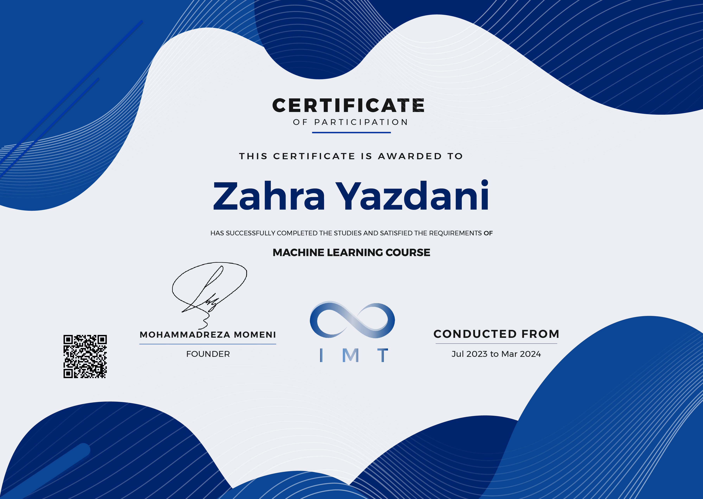

# Data Science Course

### Projects, Exercises & Certificate

A collection of practical projects and exercises completed throughout my **Data Science course**, covering **Exploratory Data Analysis (EDA)** and **Machine Learning (ML)**.

This repository documents my hands-on learning journey, from exploring and preparing real-world datasets to building, evaluating, and comparing machine learning models.

---

## About the Course

The course focused on developing practical skills in **Data Analysis and Machine Learning** through hands-on exercises and projects.

Throughout the course, I worked with different datasets and learned how to approach a data science problem from the initial exploration stage to model development and evaluation.

### Topics Covered

| Area                   | Topics                                                     |
| ---------------------- | ---------------------------------------------------------- |
| **EDA**                | Data Exploration, Statistical Analysis, Data Visualization |
| **Data Preprocessing** | Missing Values, Feature Analysis, Data Cleaning            |
| **Machine Learning**   | Classification, Regression, Logistic Regression            |
| **Model Evaluation**   | Performance Evaluation, Model Comparison                   |
| **Tools**              | Python, Pandas, NumPy, Matplotlib, Seaborn, Scikit-learn   |

---

## Repository Structure

```text
IMT-Course/
│
├── EDA/
│   ├── Exercise-01/
│   ├── Exercise-02/
│   └── Exercise-03/
│
├── ML/
│   ├── classification/
│   │   ├── Bank_Personal_Loan_Modelling/
│   │   └── Mobile-price-classification/
│   │
│   ├── LogesticRegression/
│   │   ├── Diabetes-LogesticProject.ipynb
│   │   └── diabetes.csv
│   │
│   └── Regression/
│       ├── Car-Price-Regression.ipynb
│       └── cardata.csv
│
├── Certificate/
│   └── certificate.JPG
│
└── README.md
```

---

## Exploratory Data Analysis

The `EDA` directory contains practical exercises focused on exploring, understanding, and analyzing datasets before applying machine learning models.

The exercises include:

* Dataset structure and statistical analysis
* Missing value detection and handling
* Feature exploration
* Data visualization
* Feature-to-feature relationship analysis
* Working with real-world datasets

These exercises helped develop a systematic approach to understanding data, identifying patterns, and detecting potential data quality issues before modeling.

---

## Machine Learning

The `ML` directory contains the machine learning projects completed throughout the course.

### Classification

**Mobile Price Classification**

A classification project focused on predicting mobile phone price categories using machine learning algorithms.

**Bank Personal Loan Modelling**

A classification project focused on predicting whether a customer would accept a personal loan based on customer-related features.

### Regression

**Car Price Regression**

A regression project focused on predicting car prices based on available vehicle features.

### Logistic Regression

**Diabetes Prediction**

A classification project using Logistic Regression to predict diabetes-related outcomes from medical dataset features.

Each project contains the corresponding dataset and Jupyter Notebook used throughout the analysis and modeling process.

---

## Technologies

<p align="center">


</p>

---

## Certificate

I successfully completed the Data Science course and received a certificate upon completion.

The certificate is included in this repository:

`Certificate/certificate.JPG`

<p align="center">
  
</p>

---

## Learning Outcomes

Through the projects and exercises in this repository, I gained practical experience in:

* Exploring and understanding real-world datasets
* Cleaning and preprocessing data
* Identifying missing values and data quality issues
* Performing exploratory data analysis
* Visualizing and interpreting relationships between features
* Building classification and regression models
* Evaluating machine learning models
* Comparing different machine learning algorithms
* Working with Python-based data science tools
* Managing and documenting projects using Git and GitHub

---

## About This Repository

This repository represents a practical record of my progress throughout the course.

Rather than containing only theoretical material, it focuses on **hands-on implementation**, documenting the process of working with data, analyzing it, and applying machine learning techniques to different problems.

It also serves as a foundation for continuing my learning journey in **Data Science and Machine Learning**.

---

<p align="center">
  <i>Building practical skills through continuous learning and experimentation.</i>
</p>
